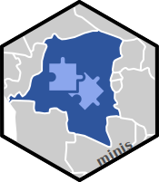

CAI-RDC : Minis 
====================================================================================================

<!-- badges: start -->

 <!--badges: end -->

Context
----------------------------------------------------------------------------------------------------
Ce dépôt fait partie de la collection Analyse intégrée des épidémies pour la RDC (CAI-RDC). Il est destiné aux analyses plus petites ou ponctuelles qui ne nécessitent pas de référentiel propre au niveau du projet.

Si vous avez des questions ou des commentaires, merci d'ouvre un issue.

Résumé des Sous-Dossiers
----------------------------------------------------------------------------------------------------

-`epicurve_collect` : Crée une épicourbe avec une légende indiquant quels cas ont été enquêtés et quand les enquêtes ont été menées.
